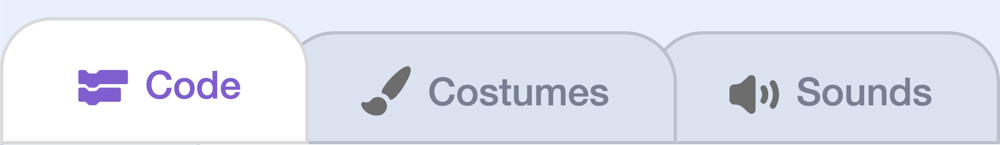

## Add a collision sound

{:width="100px" height="100px" style="object-fit: contain;"}

## Step 1

{:width="313px"}

With **Dinosaur5** selected, open the **Sounds** tab. Select **bite** and click the play button to hear it.

## Step 2

{:width="313px"}

Return to the **Code** tab. Inside the collision check, add `play sound () until done`{:class="block3sound"} before `stop all`{:class="block3control"}. Choose **bite** in the sound dropdown.

```blocks3
if <touching (Pico v)?> then
+    play sound (bite v) until done
    stop [all v]
end
```

## Now run your code

Click the green flag and let a **Dinosaur5** clone catch **Pico**.

**bite** plays until it finishes, then the game stops.
