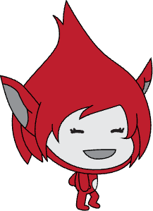

## Make the character jump

Make the character jump up and land back in the same place.

> [!TASK]
>
> Select the character sprite. Add a new script that makes it glide upwards when the player presses the space key.
>
> {:width="100px" height="100px" style="object-fit: contain;"}
>
> ```blocks3
> +when [space v] key pressed
> +glide (0.3) secs to x: (-100) y: (80)
> ```
>
> Use the same `x` position as the character's starting position. Choose a higher `y` position for the top of the jump. The example character starts at `x: -100`, `y: -70` and jumps to `y: 80`.

> [!TASK]
>
> Add another glide block to make the character land.
>
> {:width="100px" height="100px" style="object-fit: contain;"}
>
> ```blocks3
> when [space v] key pressed
> glide (0.3) secs to x: (-100) y: (80)
> +glide (0.7) secs to x: (-100) y: (-70)
> ```
>
> The final `x` and `y` values must be the same as the character's starting position in the green flag script.

> [!TASK]
>
> **Test your project.** The character should jump up and come back down when you press the space key.
