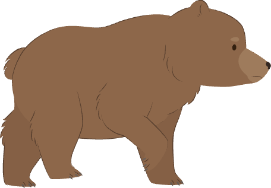

## Make the obstacles move

Make lots of obstacles appear and move towards the character.

> [!TASK]
>
> Extend the obstacle's green flag script with these blocks.
>
> ```blocks3
> when green flag clicked
> set rotation style [left-right v]
> set size to (25) %
> go to x: (280) y: (-85)
> point in direction (-90)
> +hide
> +wait (1) seconds
> +forever
> +  create clone of (myself v)
> +  wait (1) seconds
> +end
> ```
>
> A **clone** is a copy of a sprite. The original obstacle stays hidden so that only its copies appear.

> [!TASK]
>
> Replace the `wait (1) seconds`{:class="block3control"} block inside the forever loop with this block from the `Operators`{:class="block3operators"} menu:
>
> ```blocks3
> wait (pick random (0.8) to (2.4)) seconds
> ```
>
> The first clone is made after one second. After that, clones are created at random intervals that you choose.

> [!TASK]
>
> Drag a `when I start as a clone`{:class="block3control"} block to prepare each new clone.
>
> {:width="100px" height="100px" style="object-fit: contain;"}
>
> ```blocks3
> +when I start as a clone
> +show
> ```

> [!TASK]
>
> Open the `Variables`{:class="block3variables"} menu, select **Make a Variable**, and create a variable called `speed`{:class="block3variables"} for all sprites. Untick the checkbox beside `speed`{:class="block3variables"} so it is hidden on the Stage.
>
> 
>
> Set `speed`{:class="block3variables"} in the obstacle's green flag script. A negative value makes the clones move to the left.
>
> ```blocks3
> when green flag clicked
> set rotation style [left-right v]
> +set [speed v] to (-5)
> set size to (25) %
> go to x: (280) y: (-85)
> point in direction (-90)
> hide
> wait (1) seconds
> forever
>   create clone of (myself v)
>   wait (pick random (0.8) to (2.4)) seconds
> end
> ```

> [!TASK]
>
> Make each clone move until it passes the left side of the Stage. Drag in a `repeat until`{:class="block3control"} block, then add the `<`{:class="block3operators"} block from the `Operators`{:class="block3operators"} menu. Place `x position`{:class="block3motion"} on its left side.
>
> ```blocks3
> when I start as a clone
> show
> +repeat until <(x position) < (-200)>
> +  change x by (speed)
> +end
> +delete this clone
> ```
>
> `delete this clone`{:class="block3control"} removes each copy after it leaves the Stage so that clones do not build up.

> [!TASK]
>
> Add `next costume`{:class="block3looks"} inside the loop to animate the obstacle as it moves.
>
> ```blocks3
> when I start as a clone
> show
> repeat until <(x position) < (-200)>
> +  next costume
>   change x by (speed)
> end
> delete this clone
> ```

> [!TASK]
>
> **Test your project.** Obstacles should appear at different times and move from right to left.
